# nettix

A high-level networking framework built on Netty 3.x for building high-performance asynchronous servers and clients with ease.

## Overview

**nettix** is a high-performance networking framework built on Netty 3.x, designed for developing robust asynchronous servers and clients.

This framework was originally engineered to develop **high-volume, high-availability ESB (Enterprise Service Bus) hybrid API gateways** in demanding production environments. Its core design philosophy was to achieve maximum reliability and performance with **zero external dependencies**, ensuring the networking layer remains self-contained and lightweight.

While Netty has evolved, `nettix` stands as a record of high-concurrency engineering, having been battle-tested in systems handling massive traffic and complex protocol integrations.

### Key Highlights
* **Proven Stability:** Successfully managed high-availability distributed systems for over a decade.
* **Self-Contained:** Built entirely on Netty 3.x to eliminate overhead from external infrastructure.
* **Protocol Foundation:** Built-in HTTP/WebSocket with a streamlined API for custom protocol implementations (e.g., SMPP, OCPP).

## Built with nettix

Practical applications developed using the nettix framework:

* [nettix-mq](https://github.com/osanha/nettix-mq) – A high-performance light-weight message queue for HA cluster synchronization and distributed locking.
* [nettix-smpp](https://github.com/osanha/nettix-smpp) – A carrier-grade SMPP protocol implementation for SMS messaging.

## Features

### Core Features
- **High-level Channel Management**: Simplified server/client lifecycle management with automatic reconnection
- **HTTP Client/Server**: Full-featured async HTTP with connection pooling, compression, and keep-alive
- **WebSocket Support**: WebSocket client and server handlers with upgrade support
- **SSL/TLS**: Easy SSL configuration for secure connections with session reuse
- **Utility Classes**: Lifecycle management, scheduled executors, timeout maps, and more

### Protocol Development Features
- **Automated Exception Handling**: Communication and protocol exceptions are automatically mapped to appropriate HTTP status codes
  - `HttpException` → custom HTTP status
  - `TooLongFrameException` → 413 Request Entity Too Large
  - `CompressionException` → 406 Not Acceptable
  - Other exceptions → 400 Bad Request or 500 Internal Server Error

- **Easy Protocol Implementation**: Built-in handlers for common protocol patterns
  - `HeartbeatHandler<T>`: Periodic heartbeat message sending with read timeout detection
  - `EnquireLinkHandler<T>`: Enquire link (ping-pong) pattern with failure handling
  - `PersistentClientChannelManager`: Automatic reconnection on connection loss

- **Connection Management**
  - Connection pooling for HTTP keep-alive
  - Configurable reconnection count and interval
  - Connection timeout handling

- **Content Compression**: Built-in GZIP and DEFLATE support for HTTP messages

## Modules

| Package | Description |
|---------|-------------|
| `io.nettix.channel` | Core channel management (ServerChannelManager, ClientChannelManager, PersistentClientChannelManager) |
| `io.nettix.http` | HTTP client/server implementation with compression and content handling |
| `io.nettix.websocket` | WebSocket protocol support |
| `io.nettix.ssl` | SSL/TLS engine factories and handshake management |
| `io.nettix.util` | Utilities (lifecycle, scheduling, caching, timeout handling) |
| `io.nettix.log` | Netty channel logging handlers |

## Class Diagram

```mermaid
classDiagram
    direction TB

    %% Lifecycle Management
    class AbstractStartable {
        <<abstract>>
        #name: String
        #state: State
        +setUp()*
        +tearDown()*
        +start()
        +stop()
    }

    %% Channel Management Hierarchy
    class AbstractChannelManager {
        <<abstract>>
        #sslFactory: SslEngineFactory
        #bootstrap: Bootstrap
        +getPipeline(): ChannelPipeline
        +setSslEngineFactory()
        +configure(Bootstrap)*
    }

    class ServerChannelManager {
        #port: int
        #backlog: int
        +setUp()
        +bind()
    }

    class ClientChannelManager {
        #reconnCount: int
        #reconnInterval: int
        #connTimeout: long
        +connect(SocketAddress): ChannelFuture
    }

    class PersistentClientChannelManager {
        #reconnDelay: int
        +setReconnDelay(int)
    }

    class HttpServer {
        -handler: HttpRequestHandler
        -encoding: HttpContentEncoding
        -timeout: int
        +setHandler()
        +setContentEncoding()
    }

    class HttpClient {
        -connPool: Queue~Channel~
        -host: String
        -resTimeout: int
        +execute(HttpRequest): CallableChannelFuture
    }

    %% Inheritance relationships
    AbstractStartable <|-- AbstractChannelManager
    AbstractChannelManager <|-- ServerChannelManager
    AbstractChannelManager <|-- ClientChannelManager
    ServerChannelManager <|-- HttpServer
    ClientChannelManager <|-- HttpClient
    ClientChannelManager <|-- PersistentClientChannelManager

    %% HTTP Message Hierarchy
    class HttpMessage {
        <<abstract>>
        +setContent(String, String)
        +toStringHeaders()
        +toStringContent()
    }

    class HttpRequest {
        -method: HttpMethod
        -uri: String
        +getPath(): String
        +getParameters(): Map
    }

    class HttpResponse {
        -status: HttpResponseStatus
        +getStatus()
        +setStatus()
    }

    HttpMessage <|-- HttpRequest
    HttpMessage <|-- HttpResponse

    %% Handler Hierarchy
    class ConnectStateEventHandler {
        <<abstract>>
        +channelConnected()*
        +channelDisconnected()*
    }

    class InboundMessageHandler {
        <<abstract>>
        +messageReceived()*
    }

    class OutboundMessageHandler {
        <<abstract>>
        +writeRequested()*
    }

    class MessageEventHandler {
        <<abstract>>
        +messageReceived()*
        +writeRequested()*
    }

    class HeartbeatHandler~T~ {
        -time: int
        -factory: HeartbeatFactory
        +readTimedOut()
    }

    class EnquireLinkHandler~T~ {
        -delay: int
        -factory: EnquireLinkFactory
    }

    class SslHandshaker {
        -handler: SslHandler
        -isHandshaked: boolean
    }

    ConnectStateEventHandler <|-- SslHandshaker
    ConnectStateEventHandler <|-- EnquireLinkHandler

    %% SSL Management
    class SslManager {
        <<static>>
        +loadKeyStore()
        +createServerSslFactory()
        +createClientSslFactory()
    }

    class SslEngineFactory {
        <<interface>>
        +createSslEngine(): SSLEngine
    }

    class ServerSslEngineFactory {
        +createSslEngine()
    }

    class ClientSslEngineFactory {
        -addr: String
        -port: int
        +createSslEngine()
    }

    SslEngineFactory <|.. ServerSslEngineFactory
    SslEngineFactory <|.. ClientSslEngineFactory

    %% Handler Interfaces
    class HttpRequestHandler {
        <<interface>>
        +connected(Channel)
        +disconnected(Channel)
        +requestReceived(Channel, SocketAddress, HttpRequest)
        +chunkReceived(Channel, SocketAddress, HttpChunk)
    }

    class HttpResponseHandler {
        <<interface>>
        +connected(Channel)
        +disconnected(Channel)
        +responseReceived(Channel, HttpResponse)
        +exceptionCaught(Channel, Throwable)
    }

    class HeartbeatFactory~T~ {
        <<interface>>
        +createHeartbeat(): T
    }

    %% Relationships
    HttpServer ..> HttpRequestHandler : uses
    HttpClient ..> HttpResponseHandler : uses
    HeartbeatHandler ..> HeartbeatFactory : uses
    AbstractChannelManager ..> SslEngineFactory : uses
```



## Requirements

This project is based on Netty 3.x and targets legacy Java environments.

| Build Profile | Target | Required JDK |
|---------------|--------|--------------|
| modern (default) | Java 11+ | JDK 11+ |
| legacy | Java 6 bytecode | JDK 8 or earlier |

> **Note:** Legacy build is intended for archival or special-purpose environments only.
> Modern JDKs (9+) cannot compile Java 6 targets.

## Installation

### Maven

Available on JitPack. You can easily include this library in your project using the following Maven coordinates:

Add the JitPack repository to your `pom.xml`:

```xml
<repositories>
    <repository>
        <id>jitpack.io</id>
        <url>https://jitpack.io</url>
    </repository>
</repositories>
```

Add the dependency:

```xml
<dependencies>
    <dependency>
        <groupId>com.github.osanha</groupId>
        <artifactId>nettix</artifactId>
        <version>3.10</version>
    </dependency>
</dependencies>
```

### Build Profiles

The default profile is `modern`, which builds for Java 11+:

```bash
mvn clean install
```

To build for Java 6 (legacy profile), you must use JDK 8 or earlier:

```bash
mvn clean install -Plegacy
```

> **Warning:** Building the legacy profile with JDK 9 or later will fail because modern JDKs cannot target Java 6 bytecode.

## Quick Start

### HTTP Server (with SSL)

```java
// Load the keystore for SSL
SslManager.loadKeyStore("my-ssl", "PKCS12", "/path/to/keystore.p12", "storePassword", "keyPassword");

// Create HTTPS server on port 8443
HttpServer server = new HttpServer("MyServer", 8443, "my-ssl");
server.setHandler(new HttpRequestHandler() {
    @Override
    public void connected(Channel ch) {
        // Connection established
    }

    @Override
    public void disconnected(Channel ch) {
        // Connection closed
    }

    @Override
    public void requestReceived(Channel ch, SocketAddress addr, HttpRequest req) throws Exception {
        HttpResponse res = new HttpResponse(HttpResponseStatus.OK);
        res.setContent("Hello, World!", "text/plain");
        ch.write(res);
    }

    @Override
    public void chunkReceived(Channel ch, SocketAddress addr, HttpChunk chunk) throws Exception {
        if (chunk.isLast()) {
            HttpResponse res = new HttpResponse(HttpResponseStatus.OK);
            ch.write(res);
        }
    }
});

server.setUp();
```

### HTTP Client (without SSL)

```java
// Create HTTP client (no SSL)
HttpClient client = new HttpClient("MyClient", "api.example.com", 80);
client.setKeepAlive(true);
client.setResponseTimeout(30);
client.setUp();

// Send a GET request
HttpRequest req = new HttpRequest(HttpMethod.GET, "/users");
CallableChannelFuture<HttpResponse> future = client.execute(req);

// Async callback
future.addListener(new CallableChannelFutureListener<HttpResponse>() {
    @Override
    public void operationComplete(CallableChannelFuture<HttpResponse> future) throws Exception {
        if (future.isSuccess()) {
            HttpResponse res = future.get();
            System.out.println("Status: " + res.getStatus());
            System.out.println("Body: " + res.toStringContent());
        } else {
            future.getCause().printStackTrace();
        }
    }
});

// Or blocking call with timeout
HttpResponse res = future.get(10, TimeUnit.SECONDS);
```

### Custom Protocol Server

```java
public class MyProtocolServer extends ServerChannelManager {

    public MyProtocolServer(int port) {
        super("MyProtocol", port);
    }

    @Override
    public ChannelPipeline getPipeline() throws Exception {
        ChannelPipeline p = super.getPipeline();
        p.addLast("DECODER", new MyProtocolDecoder());
        p.addLast("ENCODER", new MyProtocolEncoder());
        p.addLast("HANDLER", new MyProtocolHandler());
        return p;
    }
}
```

### Custom Protocol Client with Auto-Reconnection

```java
public class MyProtocolClient extends PersistentClientChannelManager {

    public MyProtocolClient() {
        super("MyProtocol");
        setReconnDelay(5);  // Reconnect after 5 seconds on disconnect
    }

    @Override
    public ChannelPipeline getPipeline() throws Exception {
        ChannelPipeline p = super.getPipeline();
        p.addLast("DECODER", new MyProtocolDecoder());
        p.addLast("ENCODER", new MyProtocolEncoder());
        p.addLast("HANDLER", new MyProtocolHandler());
        return p;
    }
}
```

### Using Heartbeat Handler

```java
public class MyProtocolClient extends ClientChannelManager {

    public MyProtocolClient() {
        super("MyProtocol");
    }

    @Override
    public ChannelPipeline getPipeline() throws Exception {
        ChannelPipeline p = super.getPipeline();
        p.addLast("DECODER", new MyProtocolDecoder());
        p.addLast("ENCODER", new MyProtocolEncoder());

        // Send heartbeat every 30 seconds, timeout after 60 seconds of no response
        p.addLast("HEARTBEAT", new HeartbeatHandler<MyHeartbeatMessage>(
            "MyProtocol",
            30,  // heartbeat interval
            60,  // read timeout
            new HeartbeatFactory<MyHeartbeatMessage>() {
                @Override
                public MyHeartbeatMessage createHeartbeat() {
                    return new MyHeartbeatMessage();
                }
            }
        ));

        p.addLast("HANDLER", new MyProtocolHandler());
        return p;
    }
}
```

## Architecture

```
+-----------------------------------------------------+
|                    Your Application                  |
+-----------------------------------------------------+
|  nettix-mq  |  nettix-smpp  |  Your Custom Protocol |
+-----------------------------------------------------+
|                       nettix                         |
|  +---------+ +----------+ +---------+ +-----------+ |
|  |  HTTP   | |WebSocket | |   SSL   | |  Channel  | |
|  |Client/  | | Client/  | | Engine  | |  Manager  | |
|  | Server  | |  Server  | |         | |           | |
|  +---------+ +----------+ +---------+ +-----------+ |
+-----------------------------------------------------+
|                    Netty 3.x                         |
+-----------------------------------------------------+
```

## Pipeline Architecture

### Server Pipeline
```
+------------+     +-----------+     +---------------+     +-------------+
| IO_LOGGER  | --> |SSL_HANDLER| --> |CHANNEL_GROUP  | --> |PROTOCOL_    |
|            |     |(optional) |     |(optional)     |     |CODEC/HANDLER|
+------------+     +-----------+     +---------------+     +-------------+
```

### HTTP Server Pipeline
```
IO_LOGGER -> SSL_HANDLER? -> CHANNEL_GROUP? -> HTTP_SERVER_CODEC
  -> COMPRESSOR? -> CONTENT_HANDLER -> REQUEST_TIMEOUT
  -> DECOMPRESSOR -> HTTP_LOGGER -> HTTP_SERVER_HANDLER
```

### HTTP Client Pipeline
```
IO_LOGGER -> SSL_HANDLER? -> CHANNEL_GROUP? -> HTTP_CLIENT_CODEC
  -> CONTENT_LENGTH -> DECOMPRESSOR -> COMPRESSOR?
  -> HTTP_LOGGER -> HTTP_CLIENT_HANDLER
```

## License

MIT License

## Author

sanha