# nettix-core

A high-level Netty-based framework for building diverse asynchronous
server and client protocols quickly, reliably, and at scale.

## Overview

**nettix** is a high-level networking framework built on Netty 3.x that
enables fast and reliable development of high-performance asynchronous
servers and clients across a wide range of protocols.

It was created while building a **Transport-Agnostic API Gateway** from
scratch—a system that had to communicate simultaneously with multiple
carrier SMSCs, vehicle terminals, and external systems using
heterogeneous protocols such as HTTP, WebSocket, REST, SOAP, SMPP,
message queues, and proprietary TCP-based messaging.

Despite protocol differences, most servers and clients ultimately fall
into a small set of communication patterns:

- Long-lived connections vs request/response messaging
- Connection keep-alive via heartbeat or enquire-link (ping-pong)
- Automatic reconnection on connection loss
- Consistent socket configuration, timeout handling, logging, and
  exception mapping
- **SSL/TLS as a transparent layer**—any protocol becomes its secure
  variant (HTTP→HTTPS, WS→WSS, TCP→TLS) by simply adding SSL to the
  pipeline

nettix systematizes these recurring patterns into a cohesive high-level
API. Users focus only on implementing protocol-specific logic, while
nettix handles connection lifecycle management, failure recovery, and
common communication behaviors in a unified and predictable way.

The Transport-Agnostic API Gateway built on nettix has been running in
**global multi-region high-availability** deployments for over a decade,
proven in production environments demanding high performance, high
efficiency, and continuous availability.

### Key Highlights

* **Protocol-Centric Abstraction**
  Build any server or client protocol by implementing only the protocol
  logic, without repeatedly solving connection and failure handling.

* **Transparent SSL/TLS Integration**
  Add security to any protocol by inserting SSL into the pipeline—no
  protocol-specific changes required. Includes unified certificate and
  keystore management, session reuse, and handshake lifecycle handling
  for both client and server.

* **Battle-Tested at Scale**
  Proven in a Transport-Agnostic API Gateway operating across global
  multi-region HA clusters for over 10 years, handling massive traffic
  and complex protocol integrations.

* **Standardized Communication Patterns**
  Built-in support for common protocol behaviors such as heartbeats,
  enquire-link keep-alives, automatic reconnection, and timeout control.

* **Self-Contained and Lightweight**
  Built entirely on Netty 3.x with zero external infrastructure
  dependencies.

## Built with nettix

Practical applications developed using the nettix framework:

* [nettix-mq](https://github.com/osanha/nettix-mq) – A high-performance light-weight message queue for HA cluster synchronization and distributed locking.
* [nettix-smpp](https://github.com/osanha/nettix-smpp) – A carrier-grade SMPP protocol implementation for SMS messaging.

## Features

### Protocol-Oriented Abstractions

nettix provides high-level abstractions that systematize recurring
communication patterns found in most server and client protocols.

- **High-level Channel Management**
  Unified lifecycle management for servers and clients, including
  startup, shutdown, and automatic reconnection on failure.

- **Persistent Client Connections**
  Built-in support for long-lived client connections with configurable
  retry strategies and reconnection intervals via
  `PersistentClientChannelManager`.

- **Request/Response Messaging**
  First-class support for short-lived, message-based protocols such as
  HTTP and REST-style communication.

---

### SSL/TLS as a Pipeline Layer

nettix treats SSL/TLS as a protocol-agnostic layer that can be inserted
into any channel pipeline, transforming any protocol into its secure
variant without modifying protocol logic.

- **Unified Certificate Management** (`SslManager`)
  Load and manage multiple keystores (PKCS12, JKS) with named
  references. Configure once, reuse across servers and clients.

- **Protocol-Agnostic Security**
  The same SSL configuration works for HTTP, WebSocket, SMPP, or any
  custom TCP protocol—just add SSL handler to the pipeline.

- **Session Reuse & Performance**
  SSL session caching and reuse for reduced handshake overhead in
  high-throughput scenarios.

- **Handshake Lifecycle** (`SslHandshaker`)
  Built-in handler for SSL handshake completion events, enabling
  protocol logic to proceed only after secure connection is established.

```java
// Any protocol becomes secure by adding SSL
SslManager.loadKeyStore("my-cert", "PKCS12", "/path/to/cert.p12", "pass", "keypass");

// HTTP → HTTPS
HttpServer httpsServer = new HttpServer("SecureAPI", 8443, "my-cert");

// Custom protocol → Custom protocol over TLS
public class MyProtocolServer extends ServerChannelManager {
    public MyProtocolServer(int port, String sslName) {
        super("MyProtocol", port);
        setSslEngineFactory(SslManager.createServerSslFactory(sslName));
    }
}
```

---

### Built-in Communication Patterns

Common protocol behaviors are provided as reusable handlers instead of
being reimplemented per protocol.

- **Heartbeat-Based Keep-Alive** (`HeartbeatHandler<T>`)
  Periodic heartbeat sending with read-timeout detection for
  connection-oriented protocols.

- **Enquire-Link Pattern** (`EnquireLinkHandler<T>`)
  Standardized ping-pong keep-alive widely used in carrier-grade
  protocols such as SMPP.

- **Automatic Failure Recovery**
  Transparent handling of connection loss, read timeouts, and protocol
  errors with predictable recovery behavior.

---

### Exception Handling & Observability

- **Automated Exception Mapping**
  Communication and protocol exceptions are consistently mapped to
  appropriate HTTP status codes when applicable:
  - `HttpException` → custom HTTP status
  - `TooLongFrameException` → 413 Request Entity Too Large
  - `CompressionException` → 406 Not Acceptable
  - Other exceptions → 400 Bad Request or 500 Internal Server Error

- **Consistent Logging Hooks**
  Centralized logging points for connection state changes, protocol
  errors, and unexpected disconnections.

---

### Transport Protocols

- **HTTP Client / Server**
  Fully asynchronous HTTP with connection pooling, keep-alive,
  compression, and configurable timeouts.

- **WebSocket Support**
  WebSocket client and server handlers with protocol upgrade handling.

---

### Utilities for Protocol Implementations

- **Timeout & Scheduling Utilities**
  Read/write timeout control, scheduled executors, and retry management.

- **Lifecycle Utilities**
  Consistent start/stop semantics for all servers and clients via
  `AbstractStartable`.

- **Content Compression**
  Built-in GZIP and DEFLATE support for HTTP messages.

## Modules

| Package | Description |
|---------|-------------|
| `io.nettix.channel` | Core channel management (ServerChannelManager, ClientChannelManager, PersistentClientChannelManager) |
| `io.nettix.http` | HTTP client/server implementation with compression and content handling |
| `io.nettix.websocket` | WebSocket protocol support |
| `io.nettix.ssl` | SSL/TLS engine factories and handshake management |
| `io.nettix.util` | Utilities (lifecycle, scheduling, caching, timeout handling) |
| `io.nettix.log` | Netty channel logging handlers |

## Class Diagram

```mermaid
classDiagram
    direction TB

    %% Lifecycle Management
    class AbstractStartable {
        <<abstract>>
        #name: String
        #state: State
        +setUp()*
        +tearDown()*
        +start()
        +stop()
    }

    %% Channel Management Hierarchy
    class AbstractChannelManager {
        <<abstract>>
        #sslFactory: SslEngineFactory
        #bootstrap: Bootstrap
        +getPipeline(): ChannelPipeline
        +setSslEngineFactory()
        +configure(Bootstrap)*
    }

    class ServerChannelManager {
        #port: int
        #backlog: int
        +setUp()
        +bind()
    }

    class ClientChannelManager {
        #reconnCount: int
        #reconnInterval: int
        #connTimeout: long
        +connect(SocketAddress): ChannelFuture
    }

    class PersistentClientChannelManager {
        #reconnDelay: int
        +setReconnDelay(int)
    }

    class HttpServer {
        -handler: HttpRequestHandler
        -encoding: HttpContentEncoding
        -timeout: int
        +setHandler()
        +setContentEncoding()
    }

    class HttpClient {
        -connPool: Queue~Channel~
        -host: String
        -resTimeout: int
        +execute(HttpRequest): CallableChannelFuture
    }

    %% Inheritance relationships
    AbstractStartable <|-- AbstractChannelManager
    AbstractChannelManager <|-- ServerChannelManager
    AbstractChannelManager <|-- ClientChannelManager
    ServerChannelManager <|-- HttpServer
    ClientChannelManager <|-- HttpClient
    ClientChannelManager <|-- PersistentClientChannelManager

    %% HTTP Message Hierarchy
    class HttpMessage {
        <<abstract>>
        +setContent(String, String)
        +toStringHeaders()
        +toStringContent()
    }

    class HttpRequest {
        -method: HttpMethod
        -uri: String
        +getPath(): String
        +getParameters(): Map
    }

    class HttpResponse {
        -status: HttpResponseStatus
        +getStatus()
        +setStatus()
    }

    HttpMessage <|-- HttpRequest
    HttpMessage <|-- HttpResponse

    %% Handler Hierarchy
    class ConnectStateEventHandler {
        <<abstract>>
        +channelConnected()*
        +channelDisconnected()*
    }

    class InboundMessageHandler {
        <<abstract>>
        +messageReceived()*
    }

    class OutboundMessageHandler {
        <<abstract>>
        +writeRequested()*
    }

    class MessageEventHandler {
        <<abstract>>
        +messageReceived()*
        +writeRequested()*
    }

    class HeartbeatHandler~T~ {
        -time: int
        -factory: HeartbeatFactory
        +readTimedOut()
    }

    class EnquireLinkHandler~T~ {
        -delay: int
        -factory: EnquireLinkFactory
    }

    class SslHandshaker {
        -handler: SslHandler
        -isHandshaked: boolean
    }

    ConnectStateEventHandler <|-- SslHandshaker
    ConnectStateEventHandler <|-- EnquireLinkHandler

    %% SSL Management
    class SslManager {
        <<static>>
        +loadKeyStore()
        +createServerSslFactory()
        +createClientSslFactory()
    }

    class SslEngineFactory {
        <<interface>>
        +createSslEngine(): SSLEngine
    }

    class ServerSslEngineFactory {
        +createSslEngine()
    }

    class ClientSslEngineFactory {
        -addr: String
        -port: int
        +createSslEngine()
    }

    SslEngineFactory <|.. ServerSslEngineFactory
    SslEngineFactory <|.. ClientSslEngineFactory

    %% Handler Interfaces
    class HttpRequestHandler {
        <<interface>>
        +connected(Channel)
        +disconnected(Channel)
        +requestReceived(Channel, SocketAddress, HttpRequest)
        +chunkReceived(Channel, SocketAddress, HttpChunk)
    }

    class HttpResponseHandler {
        <<interface>>
        +connected(Channel)
        +disconnected(Channel)
        +responseReceived(Channel, HttpResponse)
        +exceptionCaught(Channel, Throwable)
    }

    class HeartbeatFactory~T~ {
        <<interface>>
        +createHeartbeat(): T
    }

    %% Relationships
    HttpServer ..> HttpRequestHandler : uses
    HttpClient ..> HttpResponseHandler : uses
    HeartbeatHandler ..> HeartbeatFactory : uses
    AbstractChannelManager ..> SslEngineFactory : uses
```



## Requirements

This project is based on Netty 3.x and targets legacy Java environments.

| Target | Required JDK |
|--------|--------------|
| Java 11+ | JDK 11+ |
| Java 6 bytecode | JDK 8 or earlier |

> **Note:** Legacy build is intended for archival or special-purpose environments only.
> Modern JDKs (9+) cannot compile Java 6 targets.

## Installation

### Maven

Available on [](https://jitpack.io/#osanha/nettix).

Add the dependency:

```xml
<dependencies>
    <dependency>
        <groupId>com.github.osanha.nettix</groupId>
        <artifactId>nettix-core</artifactId>
        <version>3.2.0</version>
    </dependency>
</dependencies>
```

Note: The official Maven coordinates of nettix project are:

```text
io.nettix:nettix
```

When distributed via JitPack, the groupId is resolved as com.github.osanha based on the repository owner.

Add the JitPack repository to your `pom.xml`:

```xml
<repositories>
  <!--Prioritize Central repository for faster dependency resolution-->
  <repository>
    <id>central</id>
    <url>https://repo.maven.apache.org/maven2</url>
  </repository>
  <repository>
    <id>jitpack.io</id>
    <url>https://jitpack.io</url>
  </repository>
</repositories>
```

[//]: # (### Build Profiles)

[//]: # ()
[//]: # (The default profile is `modern`, which builds for Java 11+:)

[//]: # ()
[//]: # (```bash)

[//]: # (mvn clean install)

[//]: # (```)

[//]: # ()
[//]: # (To build for Java 6 &#40;legacy profile&#41;, you must use JDK 8 or earlier:)

[//]: # ()
[//]: # (```bash)

[//]: # (mvn clean install -Plegacy)

[//]: # (```)

[//]: # ()
[//]: # (> **Warning:** Building the legacy profile with JDK 9 or later will fail because modern JDKs cannot target Java 6 bytecode.)

## Quick Start

### HTTP Server (with SSL)

```java
// Load the keystore for SSL
SslManager.loadKeyStore("my-ssl", "PKCS12", "/path/to/keystore.p12", "storePassword", "keyPassword");

// Create HTTPS server on port 8443
HttpServer server = new HttpServer("MyServer", 8443, "my-ssl");
server.setHandler(new HttpRequestHandler() {
    @Override
    public void connected(Channel ch) {
        // Connection established
    }

    @Override
    public void disconnected(Channel ch) {
        // Connection closed
    }

    @Override
    public void requestReceived(Channel ch, SocketAddress addr, HttpRequest req) throws Exception {
        HttpResponse res = new HttpResponse(HttpResponseStatus.OK);
        res.setContent("Hello, World!", "text/plain");
        ch.write(res);
    }

    @Override
    public void chunkReceived(Channel ch, SocketAddress addr, HttpChunk chunk) throws Exception {
        if (chunk.isLast()) {
            HttpResponse res = new HttpResponse(HttpResponseStatus.OK);
            ch.write(res);
        }
    }
});

server.setUp();
```

### HTTP Client (without SSL)

```java
// Create HTTP client (no SSL)
HttpClient client = new HttpClient("MyClient", "api.example.com", 80);
client.setKeepAlive(true);
client.setResponseTimeout(30);
client.setUp();

// Send a GET request
HttpRequest req = new HttpRequest(HttpMethod.GET, "/users");
CallableChannelFuture<HttpResponse> future = client.execute(req);

// Async callback
future.addListener(new CallableChannelFutureListener<HttpResponse>() {
    @Override
    public void operationComplete(CallableChannelFuture<HttpResponse> future) throws Exception {
        if (future.isSuccess()) {
            HttpResponse res = future.get();
            System.out.println("Status: " + res.getStatus());
            System.out.println("Body: " + res.toStringContent());
        } else {
            future.getCause().printStackTrace();
        }
    }
});

// Or blocking call with timeout
HttpResponse res = future.get(10, TimeUnit.SECONDS);
```

### Custom Protocol Server

```java
public class MyProtocolServer extends ServerChannelManager {

    public MyProtocolServer(int port) {
        super("MyProtocol", port);
    }

    @Override
    public ChannelPipeline getPipeline() throws Exception {
        ChannelPipeline p = super.getPipeline();
        p.addLast("DECODER", new MyProtocolDecoder());
        p.addLast("ENCODER", new MyProtocolEncoder());
        p.addLast("HANDLER", new MyProtocolHandler());
        return p;
    }
}
```

### Custom Protocol Client with Auto-Reconnection

```java
public class MyProtocolClient extends PersistentClientChannelManager {

    public MyProtocolClient() {
        super("MyProtocol");
        setReconnDelay(5);  // Reconnect after 5 seconds on disconnect
    }

    @Override
    public ChannelPipeline getPipeline() throws Exception {
        ChannelPipeline p = super.getPipeline();
        p.addLast("DECODER", new MyProtocolDecoder());
        p.addLast("ENCODER", new MyProtocolEncoder());
        p.addLast("HANDLER", new MyProtocolHandler());
        return p;
    }
}
```

### Using Heartbeat Handler

```java
public class MyProtocolClient extends ClientChannelManager {

    public MyProtocolClient() {
        super("MyProtocol");
    }

    @Override
    public ChannelPipeline getPipeline() throws Exception {
        ChannelPipeline p = super.getPipeline();
        p.addLast("DECODER", new MyProtocolDecoder());
        p.addLast("ENCODER", new MyProtocolEncoder());

        // Send heartbeat every 30 seconds, timeout after 60 seconds of no response
        p.addLast("HEARTBEAT", new HeartbeatHandler<MyHeartbeatMessage>(
            "MyProtocol",
            30,  // heartbeat interval
            60,  // read timeout
            new HeartbeatFactory<MyHeartbeatMessage>() {
                @Override
                public MyHeartbeatMessage createHeartbeat() {
                    return new MyHeartbeatMessage();
                }
            }
        ));

        p.addLast("HANDLER", new MyProtocolHandler());
        return p;
    }
}
```

## Architecture

```
+-----------------------------------------------------+
|                    Your Application                  |
+-----------------------------------------------------+
|  nettix-mq  |  nettix-smpp  |  Your Custom Protocol |
+-----------------------------------------------------+
|                       nettix                         |
|  +---------+ +----------+ +---------+ +-----------+ |
|  |  HTTP   | |WebSocket | |   SSL   | |  Channel  | |
|  |Client/  | | Client/  | | Engine  | |  Manager  | |
|  | Server  | |  Server  | |         | |           | |
|  +---------+ +----------+ +---------+ +-----------+ |
+-----------------------------------------------------+
|                    Netty 3.x                         |
+-----------------------------------------------------+
```

## Pipeline Architecture

### Server Pipeline
```
+------------+     +-----------+     +---------------+     +-------------+
| IO_LOGGER  | --> |SSL_HANDLER| --> |CHANNEL_GROUP  | --> |PROTOCOL_    |
|            |     |(optional) |     |(optional)     |     |CODEC/HANDLER|
+------------+     +-----------+     +---------------+     +-------------+
```

### HTTP Server Pipeline
```
IO_LOGGER -> SSL_HANDLER? -> CHANNEL_GROUP? -> HTTP_SERVER_CODEC
  -> COMPRESSOR? -> CONTENT_HANDLER -> REQUEST_TIMEOUT
  -> DECOMPRESSOR -> HTTP_LOGGER -> HTTP_SERVER_HANDLER
```

### HTTP Client Pipeline
```
IO_LOGGER -> SSL_HANDLER? -> CHANNEL_GROUP? -> HTTP_CLIENT_CODEC
  -> CONTENT_LENGTH -> DECOMPRESSOR -> COMPRESSOR?
  -> HTTP_LOGGER -> HTTP_CLIENT_HANDLER
```

## License

Licensed under the Apache License, Version 2.0. See [LICENSE](../LICENSE).

## Author

Sanha Lee